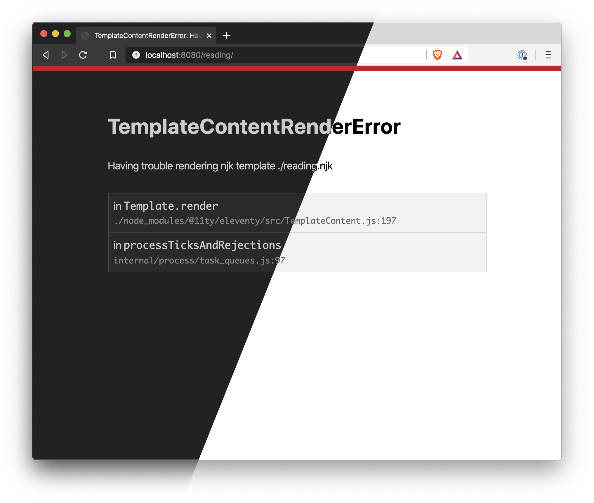

# Eleventy Error Overlay

In development, it's easy to break Eleventy without noticing. In a lot of other tools, there's often some type of "error overlay" that pipes build errors directly to the browser. This is that, for Eleventy.

- Shows error name, message, and fancy stacktrace
- Has a dark theme so you won't be suddenly blinded by your failures
- Hooks into Eleventy's live-reloading



## Installation

```sh
yarn add --dev eleventy-plugin-error-overlay
```

In `.eleventy.js`, add the plugin:

```js
const ErrorOverlay = require("eleventy-plugin-error-overlay")

module.exports = function (eleventyConfig) {
  // ...

  eleventyConfig.addPlugin(ErrorOverlay)

  // ...
}
```

## Caveats

### browser-sync

If you've set a custom browser-sync config, make sure you're not clobbering the existing one. That means that if your config looks like this:

```js
eleventyConfig.setBrowserSyncConfig({
  // ...stuff
})
```

Make sure that it's like this:

```js
eleventyConfig.setBrowserSyncConfig({
  ...eleventyConfig.browserSyncConfig,
  // ...stuff
})
```

Otherwise, you'll blow away this plugin's middleware and the error page won't show up.
